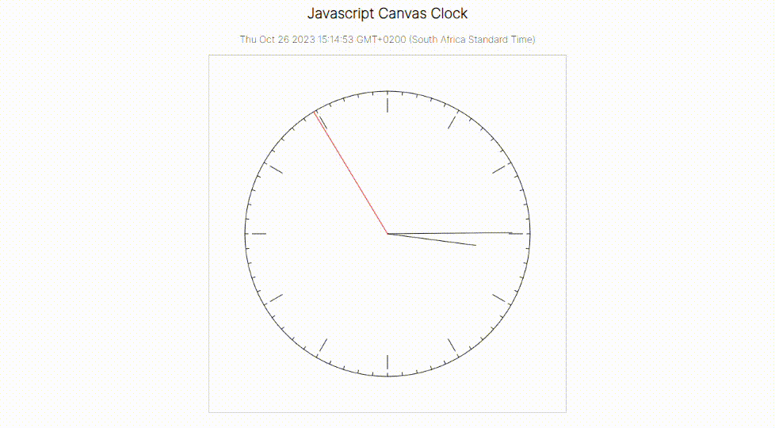
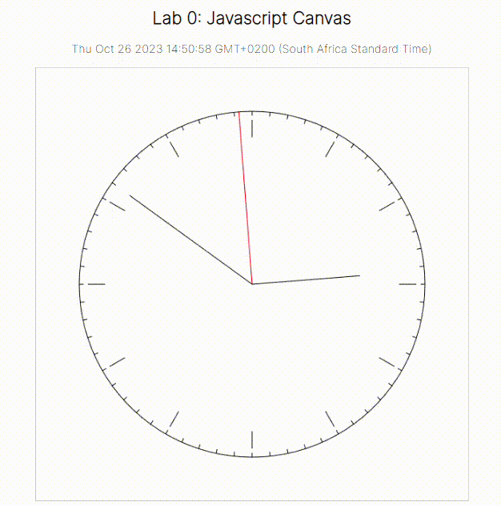

# JavaScript Canvas Clock

This is a simple clock created using JavaScript and HTML5 Canvas. Steps 1 to 10 show how the clock wwas made.



## Languages used

[](https://forthebadge.com)
[](https://forthebadge.com)
[](https://forthebadge.com)

## Table of Contents
- [JavaScript Canvas Clock](#javascript-canvas-clock)
  - [Languages used](#languages-used)
  - [Table of Contents](#table-of-contents)
  - [1. Canvas Dimensions](#1-canvas-dimensions)
  - [2. Origin and Coordinates](#2-origin-and-coordinates)
  - [3. Drawing Axes](#3-drawing-axes)
  - [4. Drawing a Circle](#4-drawing-a-circle)
  - [5. Adding Clock Tics](#5-adding-clock-tics)
  - [6. Displaying Current Datetime](#6-displaying-current-datetime)
  - [7. Creating Clock Hands](#7-creating-clock-hands)
  - [8. Using setInterval](#8-using-setinterval)
  - [9. Clearing the Canvas](#9-clearing-the-canvas)
  - [10. Smooth Clock Movement](#10-smooth-clock-movement)
  - [11. Project Completion Date](#11-project-completion-date)
  - [12. License](#12-license)

## 1. Canvas Dimensions
The canvas dimensions are specified in your code. You can adjust the width and height to fit your requirements.

## 2. Origin and Coordinates
The origin of the canvas is typically at the top-left corner (0, 0). Coordinates increase as you move right (X-axis) and down (Y-axis).

## 3. Drawing Axes
You can create a function to draw axes to help with your design.

.png)

## 4. Drawing a Circle
A circle can be drawn by generating points along its circumference and creating a path from one point to the next. Parameterise a circle with radius, r, and centre, c, as follows:

.png)

Then create a function that draws a circle of radius 240 centered in the middle of the canvas. Draw
the circle by generating points by sweeping over different values of θ ∈ [0, 2π] and creating a
path from p(θi) to p(θi+1). Close and then stroke the path. See how the circle becomes smoother as you increase the number of points.

.png)

## 5. Adding Clock Tics
To represent hours and minutes on the clock, you can create a function that draws lines from the center to different radii.

.png)

## 6. Displaying Current Datetime
You can use a JavaScript date object to display the current datetime.

```javascript
let d = new Date();
document.getElementById("some_id").innerHTML = d;
```
.png)

## 7. Creating Clock Hands
Functions convert the current time into θ values for each clock hand and draw the lines.

.png)

## 8. Using setInterval
The `setInterval` function is used to update the clock every second.

.png)

## 9. Clearing the Canvas
The canvas should be cleared before each render. Use the following code to clear the canvas:
```javascript
graphics.clearRect(0, 0, canvas.width, canvas.height);
```

.png)

## 10. Smooth Clock Movement
Adjust the code to make the clock hands move smoothly, and update the second hand every 10ms. Remove the axes/guidelines.



## 11. Project Completion Date
This project was completed on Sunday, 13 August 2023, at 5:20 PM.

## 12. License
This project is licensed under the [MIT License](LICENSE).
