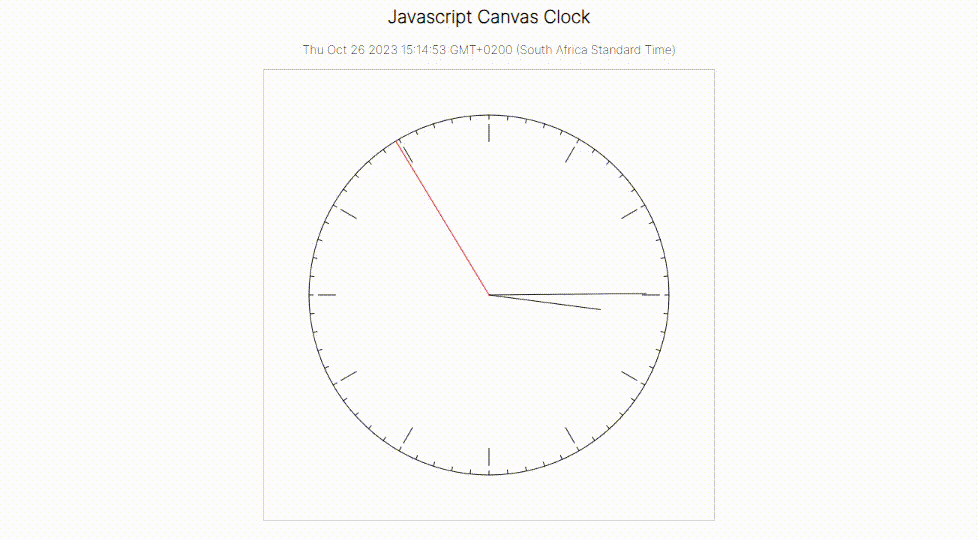

# JavaScript Canvas Clock ⏰✨

This is a vibrant and interactive clock application created using JavaScript and HTML5 Canvas! Here's how I brought it to life ⭐✨.



## Languages used

[]()
[]()
[]()

## Table of Contents
- [JavaScript Canvas Clock ⏰✨](#javascript-canvas-clock)
  - [Languages used](#languages-used)
  - [Table of Contents](#table-of-contents)
  - [1. Canvas Dimensions](#1-canvas-dimensions)
  - [2. Origin and Coordinates](#2-origin-and-coordinates)
  - [3. Drawing Axes](#3-drawing-axes)
  - [4. Drawing a Circle](#4-drawing-a-circle)
  - [5. Adding Clock Tics](#5-adding-clock-tics)
  - [6. Displaying Current Datetime](#6-displaying-current-datetime)
  - [7. Creating Clock Hands](#7-creating-clock-hands)
  - [8. Using setInterval](#8-using-setinterval)
  - [9. Clearing the Canvas](#9-clearing-the-canvas)
  - [10. Smooth Clock Movement](#10-smooth-clock-movement)
  - [11. Fetching User Timezone via IP 🌐](#11-fetching-user-timezone-via-ip)
  - [12. Project Completion Date](#12-project-completion-date)
  - [13. License](#13-license)

## 1. Canvas Dimensions 🎨
I set the canvas dimensions in the HTML, allowing flexibility to adjust the width and height to meet specific design needs.

## 2. Origin and Coordinates ➡️
The canvas origin is at the top-left corner (0, 0), and coordinates increase as you move right (X-axis) and down (Y-axis). This forms the base of our clock design.

## 3. Drawing Axes 🎩
To visualize the grid, I created a function that draws horizontal and vertical axes, emphasizing the center with red lines.

.png)

## 4. Drawing a Circle 🔹
To draw the clock face, I parameterized a circle using its radius and center coordinates. By iterating over different angles (θ), I constructed the circle smoothly. 🔬

.png)

## 5. Adding Clock Tics 🕐
To mark hours and minutes, I used a function to add "tics" at calculated angles. Longer tics represent hours, while shorter ones denote minutes.

.png)

## 6. Displaying Current Datetime 📅
I displayed the current datetime using JavaScript's `Date` object and updated it dynamically in the paragraph below the clock.

```javascript
let d = new Date();
document.getElementById("some_id").innerHTML = d;
```
.png)

## 7. Creating Clock Hands ⏳
I calculated angles for hour, minute, and second hands based on the current time. Using these angles, I drew hands radiating from the clock center.

.png)

## 8. Using setInterval ⏲
To ensure the clock updated in real-time, I used `setInterval` to refresh the drawing every second. This added a smooth and consistent animation. ✨

.png)

## 9. Clearing the Canvas 💥
Before redrawing the clock for each frame, I cleared the canvas using:

```javascript
graphics.clearRect(0, 0, canvas.width, canvas.height);
```
This avoided overlaps and ensured clean rendering.

.png)

## 10. Smooth Clock Movement 🌪
By calculating fractional angles for seconds and minutes, I made the clock hands move smoothly instead of jumping between ticks. This added realism.


## 11. Fetching User Timezone via IP 🌐
To customize the clock to the user's timezone, I integrated the `ipapi.co` API. Here's how:

- I fetched the user's timezone using their IP address.
- I used the detected timezone to adjust the time displayed by the clock.
- If timezone detection failed, I defaulted to the local time offset.

### Key Functions:
1. `**fetchTimeZone()**`:
   - Queries the API and extracts the timezone.
   - Adjusts the time offset accordingly.

2. `**updateDateTime()**`:
   - Updates the displayed time every second using the fetched timezone.

### API Details:
```javascript
async function fetchTimeZone() {
    const response = await fetch('https://ipapi.co/json/');
    const data = await response.json();
    console.log(data.timezone);
}
```
This integration ensures a personalized experience for users worldwide! ✨⌚

## 12. Project Completion Date 📆
This project was completed on Sunday, 13 August 2023, at 5:20 PM.

## 13. License 🌐
This project is licensed under the [MIT License](LICENSE).

